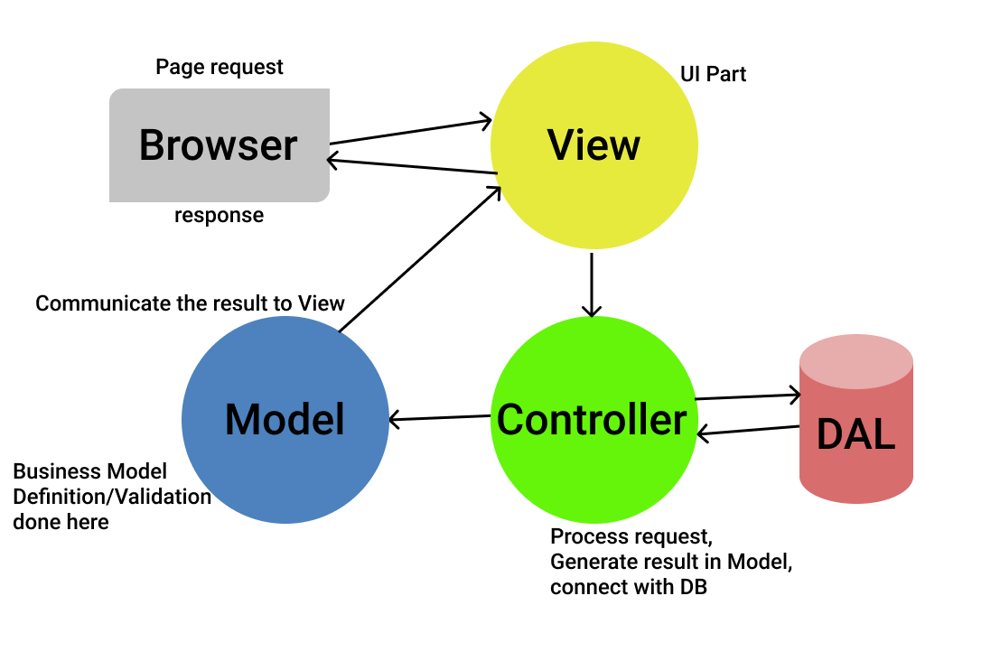

___
# Architecture

The project is a WEB-based game with ASP.NET MVC Architecture which consist of three parts:
  * Model - the details of the business object structure, data and business logic. It maintains the data of the game. 
  * View - user interface with the support of JavaScript, jQuery, Html, and CSS. business logic in the Data Access Layer. After that, we run Migrations for Connecting / Mapping our Models with Database using the help of Entity framework. Models represent the data of the application.
  * Controller - business logic in the Data Access Layer. We run Migrations for Connecting / Mapping our Models with Database using the help of Entity framework. Models represent the data of the application.

