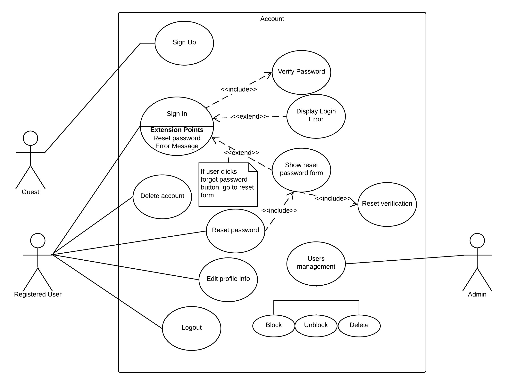
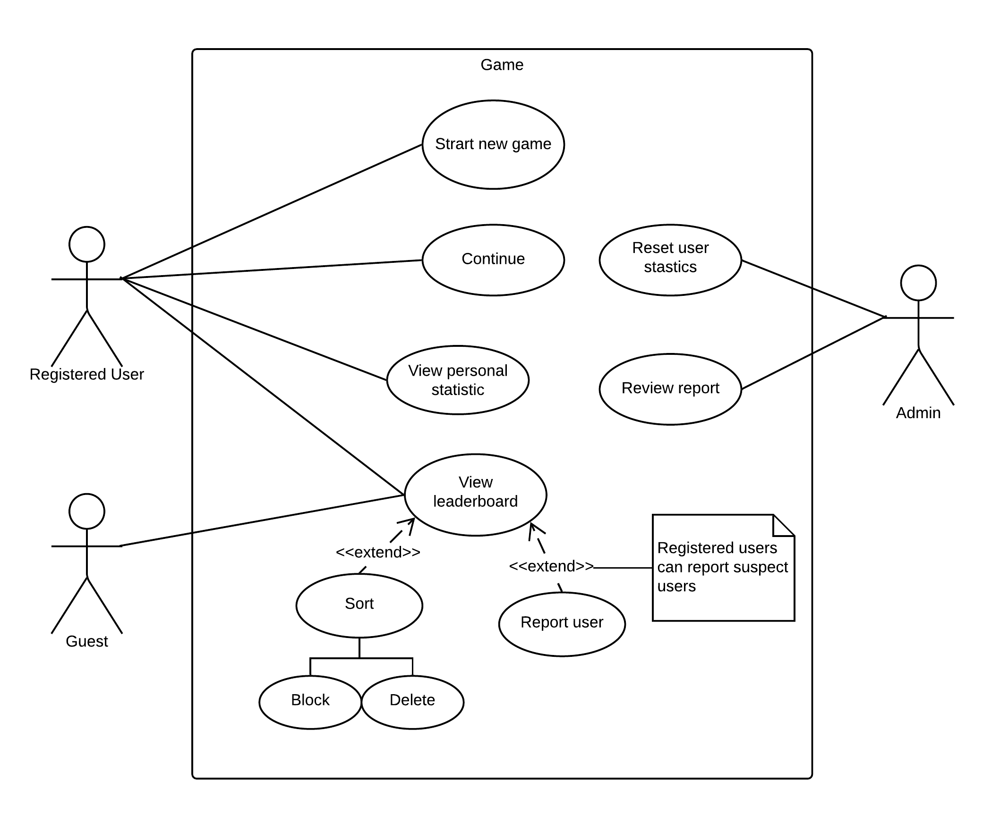

# TⓤO EMIT
TⓤO EMIT is a click-and-point game where you need get out of the maze full of puzzles in the shortest possible time. Check your ranking in the standings, get prizes, discover new levels, and don't forget about time.

## Functional Requirements 

The application should have:
*	Possibility to register an account
*	Possibility to save game progress
*	Possibility to continue previous game
*	User personal statistics (account details, achievements system)
*	Global leaderboard
*	User-friendly interface

**Role**: Guest, Logged user.

| Role       | Description                                                    |        
| ---------- | -------------------------------------------------------------- |
| Guest      | User that have not sign in yet. Can only play the game.        |
| Logged User| Can view statistics (time played, scores and ect) and can be displayed on leaderboard. |

## UML diagrams

